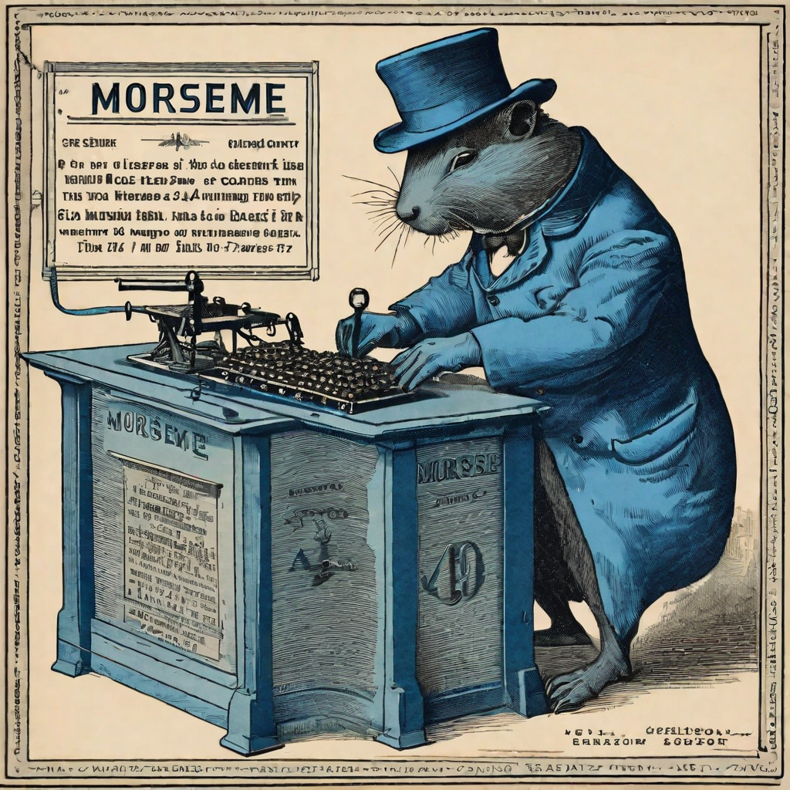
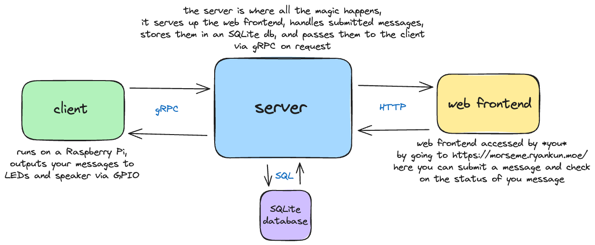

# MorseMe

Hey, welcome to the dumbest project in existence! This is a study project I have come up with which will involve the following libraries, tools and technologies:

- [Go](https://go.dev)
- [Templ](https://templ.guide)
- [Echo](https://echo.labstack.com)
- [Air](https://github.com/cosmtrek/air)
- [HTMX](https://htmx.org)
- [Hyperscript](https://hyperscript.org)
- [Terminal CSS](https://terminalcss.xyz)
- [GORM](https://gorm.io) to work with a [SQLite](https://www.sqlite.org/index.html) database
- [gRPC](https://grpc.io)

Many of these are technologies and tools I've wanted to learn more about and use in a project, there will of course be other libraries and tools needed to glue all of this together and produce an cohesive solution at the other end, but these are the heavy lifters in terms of getting this from my head and into a compiled, functioning live website.

## So, what am I building exactly?

Glad you asked. MorseMe will be the most useless thing in existence, very literally, it'll offer up a website (written in HTMX + Hyperscript) where visitors will be able to submit a message, the backend server (written in Go, using Echo and GORM) will handle and store that message until a client (written in Go, and using gRPC) checks in and takes the message which it will then output as morse code to an LED array and a speaker, that's it.

The project is split into two parts; the client and the server, but this breaks down to four areas of concern in total that employ specific tools and technologies:

## How can I use it?

Go to https://morseme.ryankun.moe/.

Or if you want to *use* it, download or clone the repo and look for setup.md, the plan is nothing will be hardcoded, everything that might change should be in a TOML config file somewhere, and setup.md will be your whistle stop tour of where these TOML files live.